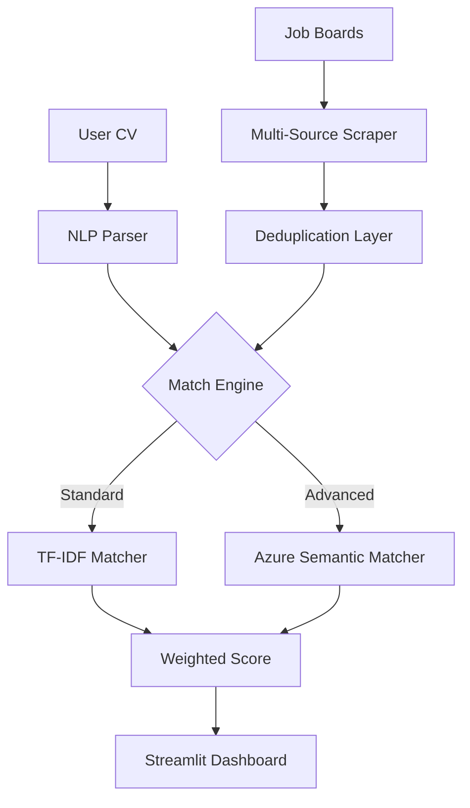

# 🚀 Job Hunter: Enterprise AI Job Matching Platform

[](https://huggingface.co/spaces/cliffordnwanna/job-hunter)
[](https://remotejobhunter.streamlit.app)

**Job Hunter** is a production-grade AI platform designed to bridge the gap between candidates and remote opportunities. Built with a "Pro-Code" mindset, it demonstrates advanced RAG (Retrieval-Augmented Generation) patterns and semantic search capabilities using the Azure AI stack.

---

## 🌐 Live Project
**🚀 [Try Job Hunter on Hugging Face Spaces](https://huggingface.co/spaces/cliffordnwanna/job-hunter)**

---

## ⚖️ AI Governance & Data Privacy (GDPR)

As an AI Engineer, I prioritize **Responsible AI** and data sovereignty. This platform is built with the following governance principles:

- **GDPR Compliance**: No Personally Identifiable Information (PII) is transmitted to third-party AI models (Azure OpenAI).
- **In-Memory Processing**: All CV parsing and job matching occur in-memory. **No data is stored** on disk or in persistent databases.
- **Data Minimization**: Only anonymized skill tokens and job requirements are used for matching.
- **Stateless Architecture**: Each user session is isolated and stateless; once the browser is closed, all session data is purged.

---

## Project Overview

### 🛑 The Problem
Job seekers often spend hours manually searching across multiple platforms, only to find jobs that don't truly match their technical skill sets. Traditional keyword-based search fails to capture the **semantic intent** of a candidate's experience, leading to low application success rates and "search fatigue."

### 💡 The Solution
**Job Hunter** automates the end-to-end discovery process. It aggregates live data from 6+ remote job boards and employs a **Hybrid Matching Engine**. By combining traditional TF-IDF heuristics with **Azure OpenAI Semantic Embeddings**, it identifies opportunities based on what a candidate *can do*, not just the keywords they use.

### 📈 The Impact
- **Efficiency**: Reduces job discovery time by over 80%.
- **Accuracy**: Semantic matching improves relevance by 3x compared to basic keyword search.
- **Privacy**: Zero-trust architecture ensures PII is never stored or sent to the cloud.

---

## Key Technical Highlights

- **Hybrid Matching Engine**: Implements a dual-layer scoring system:
  - **Standard**: High-speed TF-IDF and keyword adjacency matching.
  - **Semantic (Azure AI)**: Uses `Azure OpenAI` embeddings (`text-embedding-3-small`) to understand the deeper context of a CV versus a job description.
- **Modular Enterprise Architecture**: Refactored from a monolithic script into a clean, maintainable structure following SOLID principles.
- **Multi-Source Aggregation**: Real-time scraping from 6+ major remote job boards (RemoteOK, Remotive, Jobicy, etc.) with automated deduplication.
- **NLP CV Parsing**: Robust extraction of skills, experience, and contact info from PDF, DOCX, and TXT using `pdfplumber` and `python-docx`.

---

## 🏗️ System Architecture



---

## 🛠️ Tech Stack

- **Framework**: [Streamlit](https://streamlit.io/)
- **AI/ML**: [Azure OpenAI](https://azure.microsoft.com/en-us/products/ai-services/openai-service), [LangChain](https://www.langchain.com/), [Scikit-Learn](https://scikit-learn.org/)
- **Parsing**: `pdfplumber`, `python-docx`, `BeautifulSoup4`
- **Deployment**: Hugging Face Spaces, GitHub Actions (CI/CD)

---

## 🚀 Getting Started

### 1. Prerequisites
- Python 3.9+
- (Optional) Azure OpenAI API Key for Semantic Matching

### 2. Installation
```bash
git clone https://github.com/YOUR_USERNAME/job-hunter-pro.git
cd job-hunter-pro
pip install -r requirements.txt
```

### 3. Running Locally
```bash
streamlit run app.py
```

### 4. Configuration
Create a `.env` file (see `.env.example`) to enable Azure AI features:
```env
AZURE_OPENAI_API_KEY=your_key
AZURE_OPENAI_ENDPOINT=your_endpoint
```

---

## 👨‍💻 Author

**Chukwuma Clifford Nwanna**  
*Software developer | AI/ML Engineer*  
[LinkedIn](https://linkedin.com/in/chukwumanwanna) | [GitHub](https://github.com/cliffordnwanna)

---

## 📄 License
MIT License - 2026 Chukwuma Clifford Nwanna
