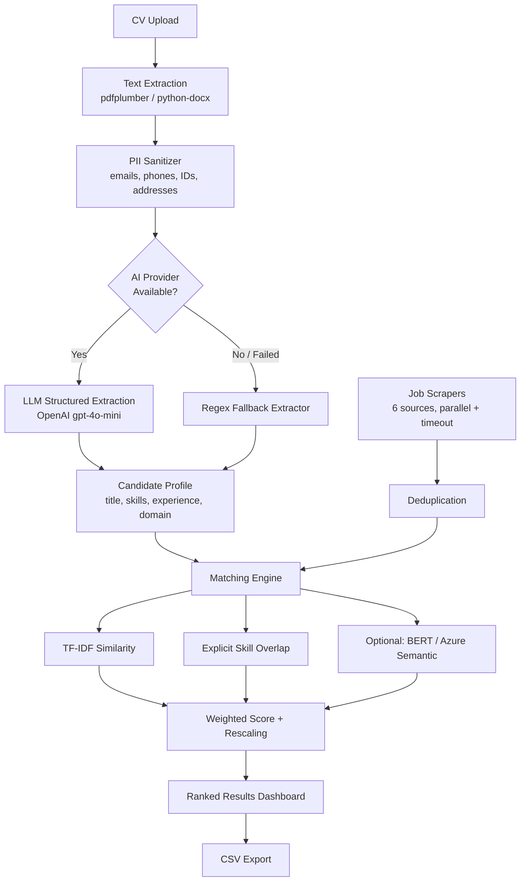

# Job Hunter

[](https://www.python.org/)
[](https://streamlit.io/)
[](https://openai.com/)
[](https://scikit-learn.org/)
[](https://www.sbert.net/)
[](https://www.crummy.com/software/BeautifulSoup/)
[](LICENSE)

> AI-powered job discovery and intelligent career matching.

Job Hunter is an AI-powered job matching platform designed to help professionals discover better career opportunities by understanding both candidates and job descriptions.

Unlike traditional recruitment platforms that depend heavily on keyword matching, Job Hunter combines AI-powered information extraction, deterministic similarity scoring, and privacy-first engineering to identify opportunities that conventional job boards often overlook.

The platform extracts a candidate's professional profile from their CV, aggregates vacancies from multiple remote job sources in parallel, and ranks opportunities by relevance rather than exact keyword overlap.

**Live Demo:** https://huggingface.co/spaces/cliffordnwanna/job-hunter

---

## Why I Built Job Hunter

Traditional recruitment platforms frequently miss qualified candidates because they rely on rigid keyword matching. A Machine Learning Engineer may never be surfaced for an Artificial Intelligence Engineer role simply because the wording differs.

I wanted to explore whether an AI-assisted pipeline could understand a candidate's actual skills and experience — rather than the exact words on their CV — while keeping the ranking logic deterministic, explainable, and free of hardcoded profession-specific rules.

The result is a hybrid system: an LLM handles the ambiguous task of reading a CV and turning it into structured data, while a deterministic scoring engine handles ranking, so the same input always produces the same, explainable output.

---

## Core Design Principles

**Structured extraction over guesswork**
CV parsing is treated as an information-extraction problem with a defined JSON schema (title, skills, experience, career level), not free-text generation — the LLM is constrained to return data the rest of the system can reason about.

**Privacy first**
CV text is scanned for emails, phone numbers, national ID numbers, credit card numbers, IP addresses, dates of birth, and street addresses, which are replaced with placeholder tokens before anything is sent to an external AI provider. The token vault is purged immediately after sanitization and is never persisted.

**Deterministic ranking**
Job ranking is computed with TF-IDF cosine similarity plus explicit skill-overlap scoring — not an LLM call — so results are reproducible, debuggable, and don't depend on a model's mood that day.

**Graceful degradation**
If no AI provider is configured or a request fails, CV parsing falls back to a curated regex-based skill matcher instead of crashing or returning nothing. The product keeps working; it just works with less precision.

**Vendor independence**
The AI provider for CV parsing (OpenAI) is decoupled from the AI provider for semantic job matching (Azure OpenAI, optional). Neither is required for the product's core loop to function — TF-IDF matching works with zero API keys.

**No hardcoded skill databases**
There is no static list of "valid" skills or professions anywhere in the codebase. The extraction schema is domain-agnostic by design, so the same pipeline works for a nurse, an electrician, or an ML engineer.

---

## Core Capabilities

**Professional profile extraction**
- LLM-based structured CV parsing (title, career level, domain, industry, years of experience)
- Skills separated into technical, tools, domain-knowledge, and soft-skill categories
- Regex-based fallback extraction when no AI provider is available

**Hybrid job matching**
- TF-IDF cosine similarity between CV text and job description
- Explicit skill-overlap scoring (phrase match, parenthetical-term match, and majority-word match for multi-word skills)
- Optional BERT and Azure OpenAI semantic matchers, blended when available
- Relative score rescaling so results communicate fit within the current result set, not raw cosine distance

**Multi-source remote job aggregation**
- Six job sources queried in parallel with per-source timeouts: RemoteOK, Remotive, Jobicy, Arbeitnow, Himalayas, WeWorkRemotely
- Automatic deduplication by URL and fuzzy title/company signature

**Privacy-first processing**
- PII sanitization before any external AI call
- No CV data or extracted profile persisted to disk
- Data is purged when the browser session ends

**Export**
- Full match list exportable as CSV, independent of what's shown on screen

---

## System Architecture



---

## Technology Stack

**Frontend**
- Streamlit
- Python 3.10+

**Artificial Intelligence**
- OpenAI (gpt-4o-mini) — CV structured extraction, used by default
- Scikit-learn — TF-IDF vectorization and cosine similarity, the default matching engine
- Sentence Transformers (optional) — local BERT semantic matching, no API key required
- Azure OpenAI (optional) — cloud embedding-based semantic matching

**Document Processing**
- pdfplumber — PDF text extraction
- python-docx — DOCX text extraction
- BeautifulSoup — HTML parsing for scraped job sources
- Requests + concurrent.futures — parallel scraping with per-source timeouts

**Deployment**
- Hugging Face Spaces (Streamlit SDK)

---

## Engineering Decisions

**Why separate CV parsing from job ranking?**
Parsing a CV is an ambiguous, unstructured task well suited to an LLM. Ranking jobs is not — it needs to be reproducible and explainable to a user asking "why did this job score higher than that one?" Keeping ranking deterministic means the answer is always inspectable in code, not buried in a model's internal weights.

**Why TF-IDF as the default matcher instead of embeddings?**
TF-IDF requires no API key, no GPU, and no cold-start model download, which matters on a free-tier deployment. It's also fully transparent: every score can be decomposed into "these specific words overlapped." BERT and Azure embeddings are available as opt-in upgrades for users who want denser semantic matching and are willing to pay the latency or cost.

**Why not use a single LLM call for the whole pipeline?**
Asking an LLM to both parse a CV and rank fifty jobs against it would be slow, expensive, and non-deterministic — the same CV could rank the same job differently on two different runs. Splitting the problem into "LLM for extraction, deterministic code for ranking" keeps the parts that need to be consistent, consistent.

**Why treat multi-word skills as partial matches, not exact strings?**
An LLM-extracted skill like "Machine learning & predictive modelling" will almost never appear verbatim in a job posting, even for a perfect-fit role. The matcher checks the full phrase, then any parenthetical terms (the most specific part of a skill entry), then falls back to majority-word overlap — so a skill still counts as relevant without requiring an exact string match that real-world job descriptions will never produce.

**Why exclude soft skills from the explicit-match boost?**
Terms like "leadership" or "stakeholder engagement" appear in almost every job posting regardless of role. Counting them toward a match score dilutes the signal that actually distinguishes a good fit from a bad one, so only technical, tool, and domain skills feed the explicit-match boost.

**Why rescale the displayed score?**
Raw cosine similarity on short texts (a CV and a single job description) rarely exceeds 15-20%, even for a strong match — that's a property of the math, not of the fit. Showing that number directly reads as "bad match" to a user even when the ranking underneath is correct. The displayed score is rescaled per result set so the best match anchors near 90% and weaker matches fall off proportionally, preserving rank order and relative gaps without fabricating precision the model doesn't have.

---

## Engineering Challenges

**Building profession-independent extraction**
The schema (title, skills, career level, domain) had to work identically for a physiotherapist and a machine learning engineer, with no per-profession branches in the code. That constraint pushed all domain knowledge into the LLM prompt rather than into hardcoded lookup tables.

**Keeping a regex fallback useful without becoming noise**
An early version of the fallback grabbed arbitrary two- and three-word phrases from the CV as "skills," producing entries like "Professional Summary Key." The fix was to constrain the fallback to a curated keyword list, so a degraded mode still produces trustworthy output instead of just more output.

**Making PII sanitization actually block on failure paths**
Sanitization needed to run before every external call, with no code path that could accidentally send raw CV text to a third party — including the fallback and retry paths, not just the happy path.

**Resilient multi-source scraping**
Six independent job boards, each with different response shapes and reliability, needed to be queried without one slow or failing source blocking the others. Each scraper runs in its own thread with a per-source timeout, and a source failing returns an empty list rather than raising.

**Fair ranking across an eclectic skill set**
A candidate profile that spans AI, embedded systems, and domain-specific knowledge (e.g. medical equipment) will legitimately overlap with many different job types. Getting the ranking to correctly prioritize the closest-fit role over a superficially-matching one required weighting technical/domain skills over near-universal soft skills in the scoring function.

---

## Repository Structure

```
.
├── app.py                    # Streamlit entry point
├── src/
│   ├── parser_v2.py          # CV text extraction + orchestration
│   ├── llm_extractor.py      # LLM structured extraction + regex fallback
│   ├── pii_sanitizer.py      # PII detection, tokenization, purge
│   ├── matcher_v2.py         # TF-IDF / BERT / Azure matchers + ranking
│   ├── scraper.py            # Parallel multi-source job scraping
│   ├── model_manager.py      # Cached model loading (BERT)
│   └── ui.py                 # Styling and job card rendering
├── tests/
│   └── test_engine.py        # Extraction + matching unit tests
├── archived/                  # Earlier prototype (notebook + script)
├── assets/                    # Screenshots
├── .streamlit/config.toml    # Streamlit theme + server settings
└── requirements.txt           # Production dependencies
```

---

## Roadmap

| Status | Feature |
|---|---|
| ✅ | AI-powered CV parsing with structured extraction |
| ✅ | Hybrid TF-IDF + explicit skill-overlap matching |
| ✅ | Optional BERT / Azure OpenAI semantic matching |
| ✅ | PII sanitization pipeline |
| ✅ | Multi-source parallel job scraping with deduplication |
| ✅ | CSV export |
| 🚧 | Resume optimizer |
| 🚧 | ATS compatibility checker |
| 🚧 | AI cover letter generator |
| 🚧 | Interview preparation assistant |
| 🚧 | Salary prediction |

---

## Lessons Learned

The most useful lesson from this project was that a good AI product is not "an LLM with a UI in front of it." It's an orchestration problem: deterministic software handles the parts that must be reproducible and explainable (ranking, filtering, deduplication), while the LLM is scoped tightly to the one task it's genuinely better at than code — reading unstructured text and turning it into structured data.

The clearest evidence of this was a matching bug this project surfaced during development: once CV parsing started producing rich, multi-word skill phrases instead of single keywords, the *matching* logic — not the parsing — became the weak link, because it was still doing exact-string comparison. Improving one AI component exposed a latent weakness in the deterministic component next to it. That's a pattern worth watching for in any hybrid AI system: better inputs don't help if the downstream logic can't use them.

This project also reinforced that privacy engineering has to be a first-class part of the pipeline, not a bolt-on — sanitization has to run on every path that reaches an external API, including fallback and retry paths, or it isn't actually a guarantee.

---

## Installation

```bash
git clone https://github.com/cliffordnwanna/JOB_HUNTER.git
cd JOB_HUNTER
pip install -r requirements.txt
```

Create a `.env` file in the project root:

```
OPENAI_API_KEY=your_key_here
OPENAI_MODEL=gpt-4o-mini
```

Without an `OPENAI_API_KEY`, the app still runs — CV parsing falls back to a local regex-based extractor.

Run locally:

```bash
streamlit run app.py
```

### Optional: semantic matching

BERT-based local semantic matching and Azure OpenAI cloud matching are both optional enhancements, not requirements:

```bash
# For local BERT semantic matching (no API key needed)
pip install sentence-transformers torch
```

```
# For Azure OpenAI semantic matching, add to .env:
AZURE_OPENAI_API_KEY=your_key_here
AZURE_OPENAI_ENDPOINT=https://your-resource-name.openai.azure.com/
AZURE_OPENAI_DEPLOYMENT=text-embedding-3-small
```

---

## Deployment

The app is deployed on Hugging Face Spaces (Streamlit SDK). To deploy your own copy:

1. Create a new Space on Hugging Face with the Streamlit SDK.
2. Push this repository to the Space's git remote.
3. Add `OPENAI_API_KEY` (and optionally the Azure variables above) as Space secrets.
4. The Space builds automatically from `requirements.txt` and launches `app.py`.

---

## License

MIT License — free to use, modify, and distribute with attribution.
